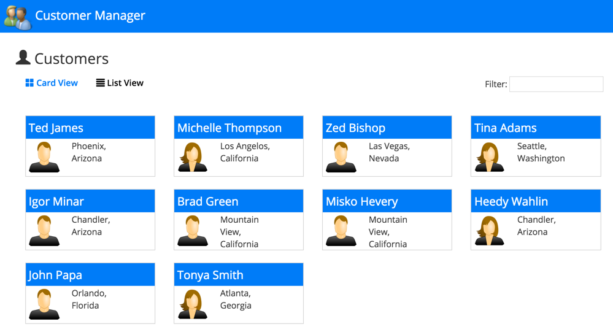
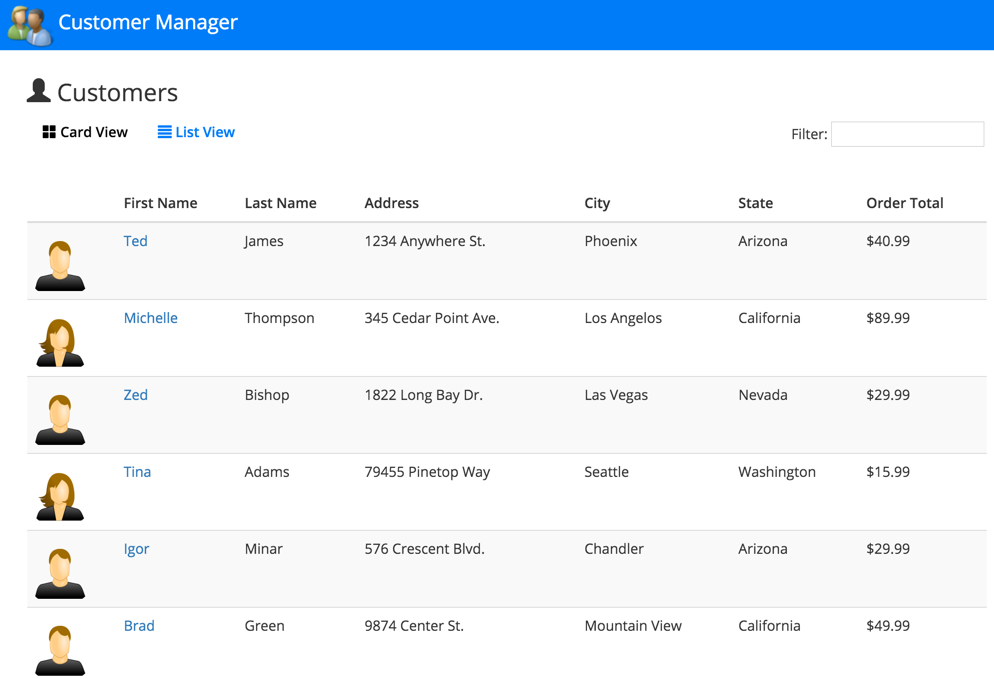
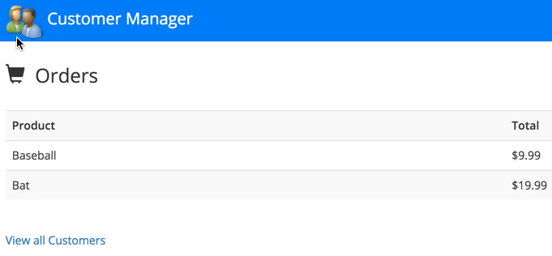

# Angular 2 JumpStart with TypeScript

The goal of this jumpstart app is to provide
a simple way to get started with Angular 2 while also showing several key Angular 2 features. The sample
relies on System.js to load TypeScript modules and the required scripts used in the application.

The sample is based on Angular 2 Beta 7.

Simply clone the project or download and extract the .zip to get started. Here are a few
screenshots from the app:

 

 

## Angular 2 Concepts Covered

* TypeScript version that relies on classes and modules
* Modules are loaded with System.js
* Defining routes 
* Using Custom Components
* Using Custom Directives
* Using Custom Pipes
* Defining Properties and Using Events in Components/Directives
* Using the Http object for Ajax calls along with Rx observables
* Working with Utility and Service classes (such as for sorting and Ajax calls)
* Using Angular 2 databinding Syntax [], () and [()]

## Running the Application

1. Run `npm install` to install app dependencies

1. Run `npm start` in a separate terminal window to start the server and launch the app

We're hard at work on a new Angular 2 hands-on/instructor-led training course 
as well as a video course that will be released in 2016!