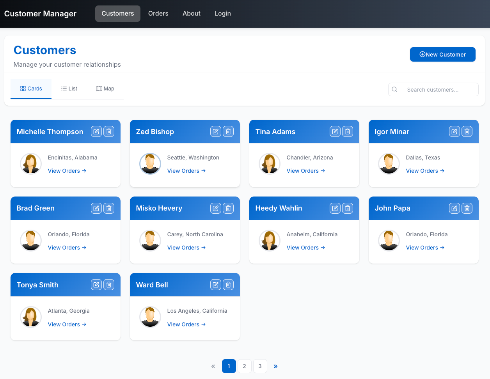
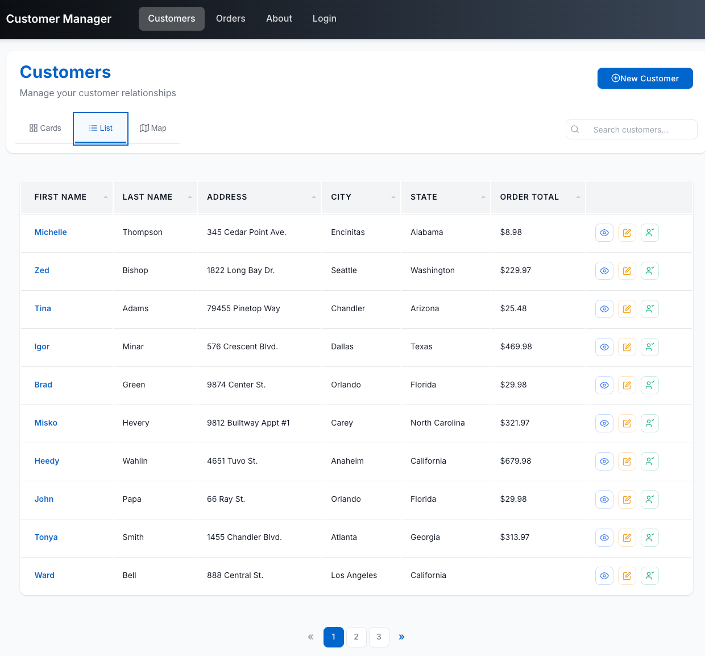
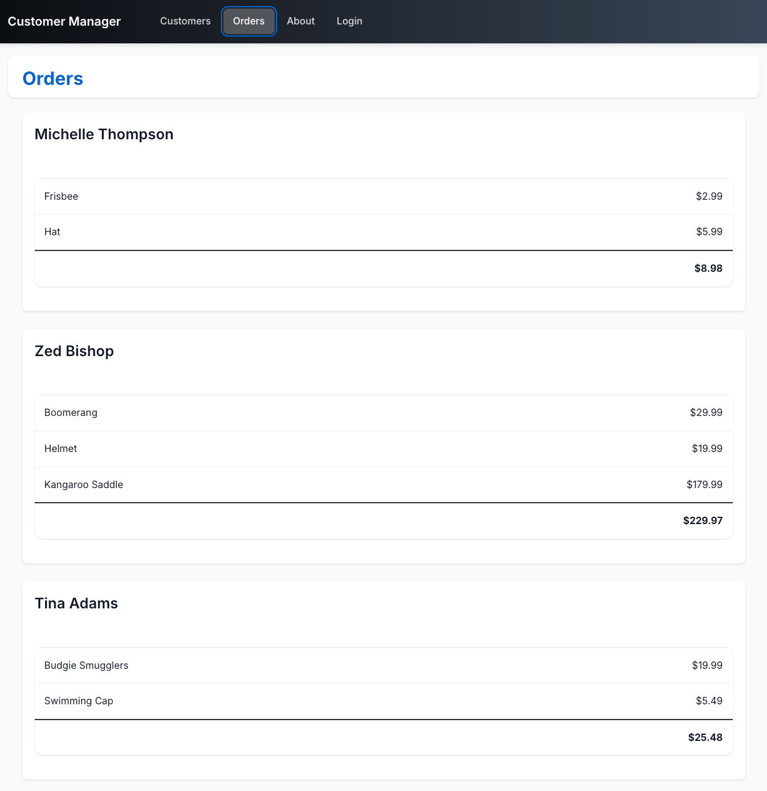
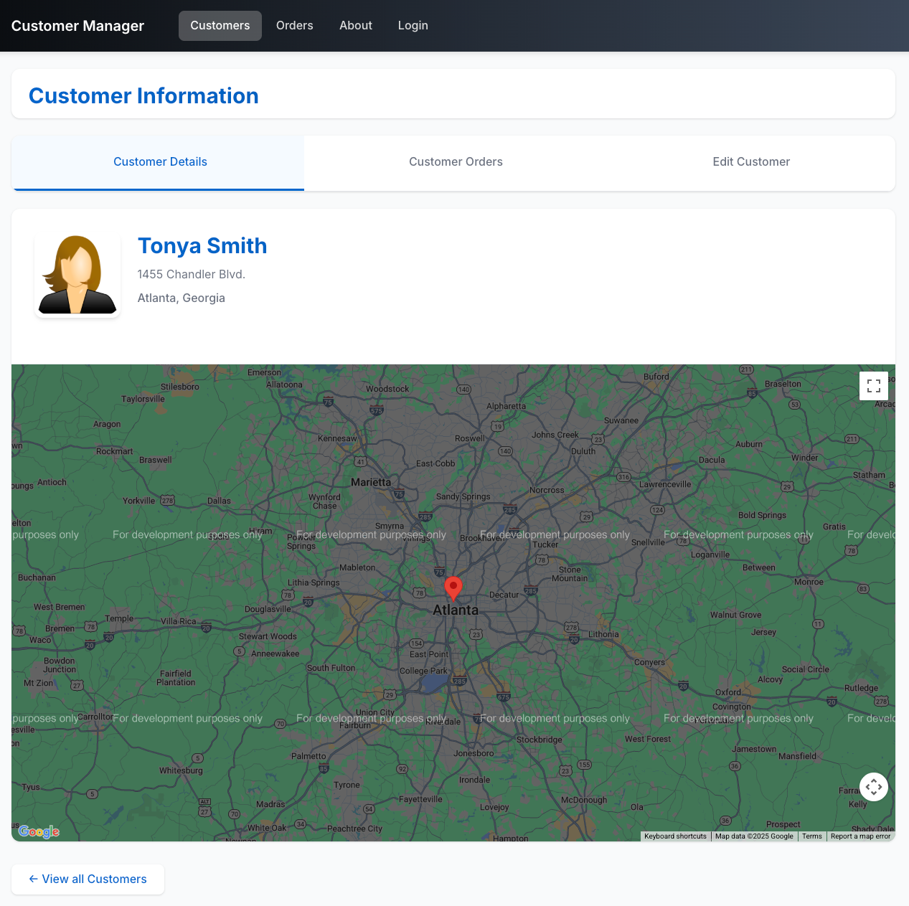

# Angular JumpStart with TypeScript

The goal of this jumpstart app is to provide
a simple way to get started with Angular 2+ while also showing several key Angular features. The sample
relies on the Angular CLI to build the application.

Looking for expert onsite Angular/TypeScript training? We've trained the biggest (and smallest :-)) companies around the world for over 15 years. For more information visit https://codewithdan.com.

## Angular Concepts Covered

* Defining routes including child routes and lazy loaded routes
* Using Custom Components including custom input and output properties
* Using Custom Directives
* Using Custom Pipes
* Defining Properties and Using Events in Components/Directives
* Using the HttpClient object for Ajax calls along with RxJS observables
* Working with Utility and Service classes (such as for sorting and HTTP calls)
* Using Angular databinding Syntax [], () and [()]
* Using template-driven and reactive forms functionality for capturing and validating data

## Running the Application with Node.js

Clone the project or download and extract the .zip to get started. 

1. Install the latest LTS version of Node.js from https://nodejs.org.

1. Run `npm install` to install app dependencies

1. Run `ng build angular-jumpstart --watch` to build and bundle the code

1. Run `npm start` in a separate terminal window to launch the web and RESTful API server

1. Go to http://localhost:8080 in your browser 

NOTE: You'll need to supply your own Google Maps API key in the `shared/map.component.ts` file to see the full map functionality. Update `https://maps.googleapis.com/maps/api/js?key=YOUR_API_KEY` with your key.

Once the app is running you can play around with editing customers after you login. Use any email address and any password that's at least 6 characters long (with 1 digit).

Here are a few screenshots from the app:



<br /><br />



<br /><br />



<br /><br />



## Running Cypress End to End Tests

1. Run `npm install cypress --save-dev` to install Cypress.
1. Run `npm run cypress` to start the Cypress test runner.

## Running in Kubernetes

1. Install Docker Desktop from https://www.docker.com/get-started
1. Start Docker and enable Kubernetes in the Docker Desktop preferences/settings
1. Run `docker-compose build` to create the images
1. Run `kubectl apply -f .k8s` to start Kubernetes
1. Visit `http://localhost`
1. Stop Kubernetes using `kubectl delete -f .k8s`

## Running with Skaffold

If you'd like to use the [Skaffold tool](https://skaffold.dev/docs/install) to run the project in Kubernetes, install it, and run the following command:

`skaffold dev`

To generate the `skaffold.yaml` file that's included in the project the following command was run and the image context paths it defines were modified:

```
skaffold init -k '.k8s/*.yml' \
  -a '{"builder":"Docker","payload":{"path":".docker/nginx.dev.dockerfile"},"image":"nginx-angular-jumpstart"}' \
  -a '{"builder":"Docker","payload":{"path":".docker/node.dockerfile"},"image":"node-service-jumpstart"}'
```

If you wanted to generate the initial Kubernetes manifest files from an existing docker-compose.yml file you can use the following command.
It uses the [Kompose tool](https://kompose.io) behind the scenes to create the YAML files

```
skaffold init --compose-file docker-compose.yml \
  -a '{"builder":"Docker","payload":{"path":".docker/nginx.dev.dockerfile"},"image":"nginx-angular-jumpstart"}' \
  -a '{"builder":"Docker","payload":{"path":".docker/node.dockerfile"},"image":"node-service-jumpstart"}'
```

# Azure Container Apps

## Build API Image

1. Go to https://github.com/danwahlin/angular-jumpstart and fork the repo.

1. Clone the forked repo to your machine.

1. Run `docker-compose build node`.

1. Tag the image with your Docker Hub repo name: `docker tag node-service-jumpstart <YOUR_DOCKER_HUB_NAME>/node-service-jumpstart`

1. `docker push <YOUR_DOCKER_HUB_NAME>/node-service-jumpstart`

## Create environment

```bash
az containerapp env create -n angular-jumpstart-env -g Angular-Jumpstart-RG \
--location westus3
```

## Deploy the API Container App

```bash
az containerapp create -n angular-jumpstart-api -g Angular-Jumpstart-RG \
--environment angular-jumpstart-env \
--image <YOUR_DOCKER_HUB_NAME>/node-service-jumpstart \
--ingress external --target-port 8080
```

> Note the fully qualified domain (fqdn) value assigned to the `angular-jumpstart-api` container app. You'll need this value in the next section.

## Add an .env File

1. Create a `.env` file in the project root.

1. Add the following key/value to the `.env` file:

  ```text
  NG_APP_API_URL=<FQDN_VALUE_FROM_YOUR_angular-jumpstart-api_CONTAINER_APP>
  ```

## Build the UI Image

1. Run `docker-compose build nginx`.

1. Tag the image with your Docker Hub repo name: 

    ```bash
    docker tag nginx-angular-jumpstart <YOUR_DOCKER_HUB_NAME>/nginx-angular-jumpstart
    ```

1. Push the image to Docker Hub:

    ```bash
    docker push <YOUR_DOCKER_HUB_NAME>/nginx-angular-jumpstart
    ```

## Deploy UI Container App

Change the image name below to match your image tag from the previous step.

```bash
az containerapp create -n angular-jumpstart-ui -g Angular-Jumpstart-RG \
--environment angular-jumpstart-env \
--image <YOUR_DOCKER_HUB_NAME>/nginx-angular-jumpstart \
--ingress external --target-port 80
```

## View the UI App

Navigate to the FQDN value shown after running the previous command.

## Add GitHub Continuous Deployment

1. Create a service principal:

    ```bash
    az ad sp create-for-rbac \
      --name AngularJumpStartServicePrincipal \
      --role "contributor" \
      --scopes /subscriptions/<SUBSCRIPTION_ID>/resourceGroups/Angular-Jumpstart-RG \
      --sdk-auth
    ```

1. Add a GitHub action for the UI container app:

    ```bash
    az containerapp github-action add \
      --repo-url "https://github.com/<OWNER>/<REPOSITORY_NAME>" \
      --context-path "./.docker/nginx.dockerfile" \
      --branch main \
      --name angular-jumpstart-ui \
      --image <YOUR_DOCKER_HUB_NAME>/nginx-angular-jumpstart
      --resource-group Angular-Jumpstart-RG \
      --registry-url docker.io \
      --registry-username <REGISTRY_USER_NAME> \
      --registry-password <REGISTRY_PASSWORD> \
      --service-principal-client-id <CLIENT_ID> \
      --service-principal-client-secret <CLIENT_SECRET> \
      --service-principal-tenant-id <TENANT_ID> \
      --login-with-github
    ```

1. Add a GitHub action for the API container app:

    ```bash
    az containerapp github-action add \
      --repo-url "https://github.com/<OWNER>/<REPOSITORY_NAME>" \
      --context-path "./.docker/node.dockerfile" \
      --branch main \
      --name angular-jumpstart-api \
      --image <YOUR_DOCKER_HUB_NAME>/node-service-jumpstart
      --resource-group Angular-Jumpstart-RG \
      --registry-url docker.io \
      --registry-username <REGISTRY_USER_NAME> \
      --registry-password <REGISTRY_PASSWORD> \
      --service-principal-client-id <CLIENT_ID> \
      --service-principal-client-secret <CLIENT_SECRET> \
      --service-principal-tenant-id <TENANT_ID> \
      --login-with-github
    ```

  1. IMPORTANT: Once the GitHub actions are added, pull the latest changes to your local repository. 

  1. Open each action file in `.github/workflows` and change the properties under `on:` to the following (in both files):

      ```yaml
      # When this action will be executed
      on:
        push:
          branches:
          - main
        pull_request:
          types: [opened, synchronize, reopened, closed]
          branches:
          - main
      ```
  
  1. Make the following changes to each respective workflow file:

      ### angular-jumpstart-ui workflow

      ```yaml
      build-args: NG_APP_API_URL=${{ secrets.NG_APP_API_URL }}
      file: ./.docker/nginx.dockerfile
      context: ./
      ```

      ### angular-jumpstart-api workflow
    
      ```yaml
      file: ./.docker/node.dockerfile
      context: ./
      ```

1. Go to your GitHub.com and navigate to your forked repo. Select `Settings --> Secrets --> Actions` from the toolbar.

1. Add the following key/value into the repository secrets. This is needed for the CI build that generates the UI image.

    ```text
    NG_APP_API_URL=<FQDN_VALUE_FROM_YOUR_angular-jumpstart-api_CONTAINER_APP>
    ```

1. Push your changes up to your repo.

1. Go to your GitHub repo on Github.com and select `Actions` from the toolbar. You should see the actions building (and hopefully deploy successfully).

1. Go to the FQDN of your `angular-jumpstart-ui` container app in the browser. The app should load if your GitHub actions deployed successfully.


